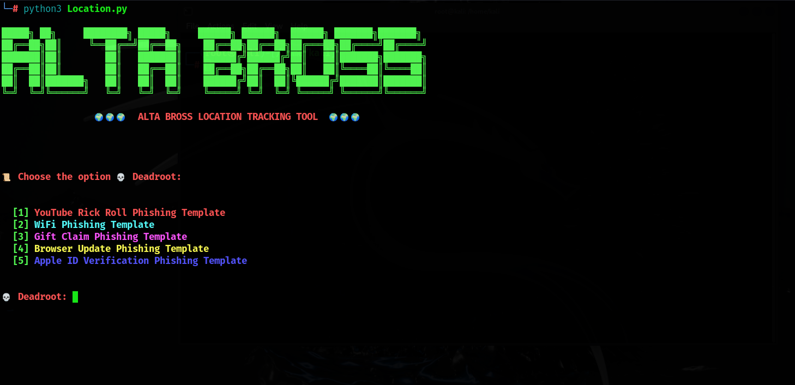

---

### 📌 **Alta-Tracker - Advanced Location Tracking Tool**  


  


**Alta-Tracker** is a powerful, lightweight location tracking tool developed by **Muhammad Alwaz**. It allows you to track a user's approximate location via **IP tracking** and fetch detailed **device information** such as:  
✔ **Battery Level**  
✔ **RAM Usage**  
✔ **Browser & OS Details**  
✔ **Exact GPS Location** (if permission is granted)  

The tool works by generating a **tracking link** that, when opened by the target, retrieves valuable **device information** and updates it in real time.  

---

### 🔥 **Features**  

- 🌍 **Track location via IP** - Get an approximate geolocation based on IP.  
- 📡 **Pinpoint GPS Location** - If the user allows, retrieve their exact GPS coordinates.  
- ⚡ **Real-Time Tracking** - Uses WebSockets for live updates.  
- 📱 **Device Information** - Fetch battery percentage, RAM status, browser, and OS details.  
- 🔧 **Easy to Use** - Just run the script and share the link!  
- 🖥 **Lightweight & Fast** - Runs smoothly on **Linux/Kali** with minimal dependencies.  

---

### 📥 **Installation (Linux/Kali)**  

#### **1️⃣ Clone the Repository**  
```bash
git clone https://github.com/AltaBros/Alta-Tracker.git
cd Alta-Tracker
```

#### **2️⃣ Set Executable Permissions**  
Before running, you need to allow the installer script to execute:  
```bash
chmod +x requirements.sh
```

#### **3️⃣ Install Dependencies**  
Run the installation script to install all required dependencies:  
```bash
./requirements.sh
```
This script installs **Python, Node.js**, and required libraries like **Flask** and **requests**.

---

### 🚀 **Running Alta-Tracker**  
Start the tracking service by running:  
```bash
python3 Location.py
```
Once running, the tool will generate a **tracking link**. Share this link with the target user. When they click, the tool will collect and display real-time data.

---

### 📑 **Usage Guide**  

Once the target opens the **tracking link**, the following data is retrieved:  
✅ **IP-based Location** – General geolocation using IP.  
✅ **Device Information** – Battery, RAM usage, OS, and browser details.  
✅ **GPS Location (if allowed)** – Get precise latitude & longitude.  
✅ **Real-Time Updates** – WebSocket ensures live tracking.  

---

### 🛠 **Customization**  

You can modify Alta-Tracker to better fit your needs:  

- **Change update intervals** – Modify `track.js` to adjust how often data updates.  
- **Modify data collection** – Edit `Location.py` to gather additional system details.  
- **Enhance UI** – Customize the `Templates/` folder to change the webpage design.  

---

### 🤝 **Contributing**  

Want to improve **Alta-Tracker**? Follow these steps:  

1. **Fork the repository**  
2. **Create a new branch** (`git checkout -b feature-name`)  
3. **Make changes** and **commit** (`git commit -m "Description of changes"`)  
4. **Push to your branch** (`git push origin feature-name`)  
5. **Submit a pull request** 🚀  

---

### ⭐ **Support & Feedback**  

If you find this tool useful, consider **giving it a ⭐ on GitHub**! Your support helps improve this project.  

For issues, suggestions, or feature requests, feel free to **open an issue** in the repository.  

---

### 📜 **License**  
This project is licensed under the **MIT License**. Please ensure you use this tool responsibly and comply with privacy laws.  

---

### 🔧 **Troubleshooting**  

#### ❓ **Missing Dependencies?**  
Ensure **Python 3** and **Node.js** are installed:  
```bash
python3 --version
node --version
```

#### ❓ **WebSocket Not Working?**  
Check firewall settings and allow traffic on the required ports.

---

### 💡 **Author**  
Developed by **Muhammad Alwaz**.  
For any inquiries, feel free to reach out!  

---

### 🚨 **Disclaimer**  
🚫 **Use this tool responsibly. Do not use it for malicious activities.** Always obtain consent before tracking users.  

---

